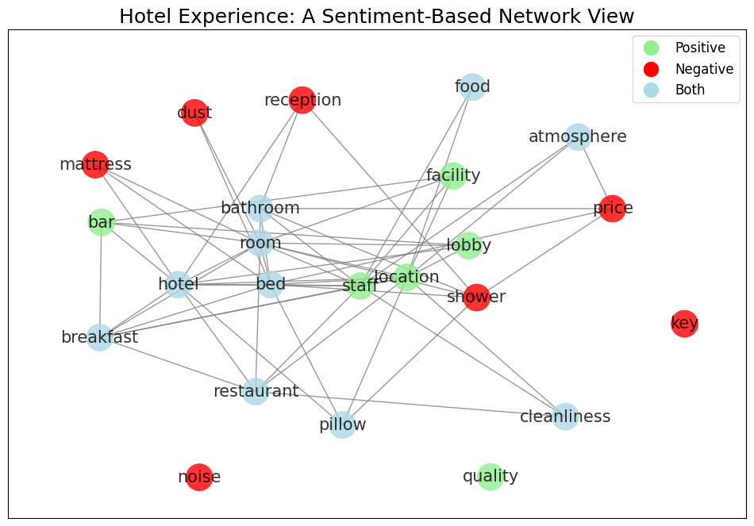
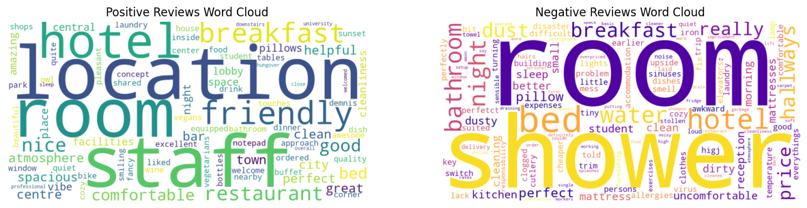

# Mistral for sentiment analysis, category classification and keyword extrction

## Introduction
This project conducts a sentiment analysis on a dataset of hotel reviews. The aim is to extract insights from customer feedback by categorizing sentiments as positive or negative and visualizing the results. The analysis includes generating word clouds and a sentiment-based network view to understand the correlation between different aspects of the hotel experience.

## Installation
To run this project, you need to install the necessary Python libraries. You can install them using the following command:
```
pip install -r requirements.txt
```

## Datasets
The project uses the following dataset:
- `reviews_small_all.csv`: A CSV file containing hotel reviews.

## Notebooks
The analysis is performed in Jupyter notebooks:
- `run_analysis.ipynb`: Runs the entire analysis and generates visualizations.
- `plots.ipynb`: Contains the code for generating the word clouds and network diagrams.
- `mistral_analysis.ipynb`: Additional analysis scripts.

## Usage
To run the analysis, execute the `run_analysis.ipynb` notebook. This will process the reviews and generate the following visualizations:
- Positive and negative word clouds showing the frequency of words in the reviews.
- A network graph illustrating the relationships between different aspects of the hotel experience and their associated sentiments.

## Visualizations
Two key visualizations are included:
- `network.png`: Shows the sentiment-based network view of hotel aspects.
- `output.png`: Contains the positive and negative word clouds.



*Sentiment-based network view of hotel aspects.*


*Word cloud for positive reviews.*
